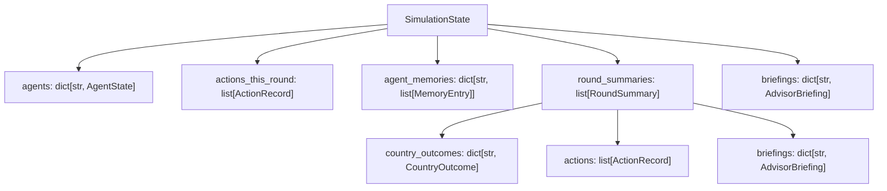

# Chapter 28: Wargame 2 — Data Layer Forensic Audit

> **Purpose**: Trace every byte from in-memory Python TypedDict → SQLite column → API JSON response. This is a forensic walkthrough of the *current* architecture — warts and all — designed to give you absolute fluency for Palantir system-design interviews.

---

## 1. The In-Memory Layer (`state.py`)

The simulation's single source of truth is a LangGraph `SimulationState` TypedDict. Every graph node receives it, returns a *partial update*, and LangGraph merges the delta back in. Seven TypedDicts compose the schema.

### 1.1 The TypedDict Hierarchy



### 1.2 Each TypedDict — Field by Field

#### `MemoryEntry` — Smallville-style memory stream

| Field | Type | Why It Exists |
|-------|------|---------------|
| `round_number` | `int` | Temporal anchor — lets consolidation know when this memory was formed |
| `timestamp` | `str` | ISO-8601 wall-clock time for debugging/ordering |
| `content` | `str` | Free-text memory (e.g., "China moved carrier group into South China Sea") |
| `importance` | `int` (1-10) | Priority for retrieval — high-importance memories survive consolidation |
| `is_reflection` | `bool` | Distinguishes raw observations from LLM-generated reflections (Smallville pattern) |
| `consolidated` | `bool` | If `True`, excluded from active prompts (archived after memory consolidation) |

**Design rationale**: This is a direct port of the Smallville "generative agents" memory architecture. The `importance` score drives retrieval — when the context window fills up, low-importance memories get consolidated first. The `consolidated` flag is the "soft delete" mechanism.

---

#### `ActionRecord` — A single leader action

| Field | Type | Why It Exists |
|-------|------|---------------|
| `round_number` | `int` | Which simulation round |
| `actor` | `str` | Country code (e.g., `"USA"`, `"CHN"`) — the FK into agents |
| `actor_name` | `str` | Human-readable leader name (e.g., "Donald Trump") — denormalized for display |
| `action_type` | `str` | Enum-like: `STATEMENT`, `MILITARY`, `ECONOMIC`, `DIPLOMATIC`, `INTELLIGENCE`, `OTHER` |
| `target` | `Optional[str]` | Target country code (nullable — some actions are unilateral) |
| `description` | `str` | Full description of the action |
| `public_statement` | `Optional[str]` | The public-facing component (press release, speech) |
| `private_channels` | `Optional[str]` | Back-channel diplomatic communication (invisible to most observers) |
| `reasoning` | `str` | The leader's internal thought process — never shown to other agents |

**Design rationale**: The `public_statement` / `private_channels` split is the **information asymmetry** mechanism. The `is_action_visible()` function uses `action_type` to determine what each observer country can see:
- `STATEMENT`, `ECONOMIC`, `MILITARY` → always visible
- `DIPLOMATIC` → visible only if `public_statement` is non-null
- `INTELLIGENCE` → always hidden (covert ops)

---

#### `AgentState` — One leader's persistent identity

| Field | Type | Why It Exists |
|-------|------|---------------|
| `country_code` | `str` | Primary key (e.g., `"USA"`) |
| `country_name` | `str` | Display name |
| `leader_name` | `str` | e.g., "Xi Jinping" |
| `leader_title` | `str` | e.g., "President" |
| `persona_description` | `str` | LLM-generated personality (decision style, known biases) |
| `recent_events_research` | `str` | Google Search–grounded post-training-date events |
| `cabinet_roster` | `str` | Key officials (names + roles) — grounded |
| `current_briefing` | `str` | Most recent advisor briefing (overwritten each round) |
| `reason_drawn_in` | `str` | Why this country was pulled into the crisis (empty for initial participants) |

**Design rationale**: Every field is a `str` — no nesting. This is deliberate: `AgentState` is injected wholesale into LLM prompts. Keeping it flat means zero serialization complexity at prompt-construction time.

---

#### `AdvisorBriefing` — 4-perspective intelligence brief

| Field | Type | Why It Exists |
|-------|------|---------------|
| `intelligence` | `str` | Threat assessment |
| `military` | `str` | Force posture and options |
| `political` | `str` | Domestic political pressures |
| `economic` | `str` | Sanctions exposure, trade risks |

**Design rationale**: Modeled after real National Security Council briefings. Four perspectives force the LLM to consider multiple dimensions before acting, reducing the "military-only" bias common in single-prompt simulation designs.

---

#### `CountryOutcome` — Dual-metric impact assessment

| Field | Type | Why It Exists |
|-------|------|---------------|
| `round_impact` | `int` (-2 to +2) | This round only: beginning-of-round → end-of-round delta |
| `round_label` | `str` | Human-readable: `"much_worse"` / `"somewhat_worse"` / `"neutral"` / `"somewhat_better"` / `"much_better"` |
| `round_reasoning` | `str` | Why this round was good/bad |
| `cumulative_impact` | `int` (-2 to +2) | Start of simulation → end of this round |
| `cumulative_label` | `str` | Same scale as `round_label` |
| `cumulative_reasoning` | `str` | Cumulative narrative |

**Design rationale**: Separating round-level from cumulative lets the frontend show both a **per-round heatmap** and a **cumulative trajectory chart**. The `cumulative_label` from the final round is extracted at the Monte Carlo level to build outcome distributions across N simulations.

---

#### `RoundSummary` — Complete record of one round

| Field | Type | Why It Exists |
|-------|------|---------------|
| `round_number` | `int` | Primary key (within a simulation) |
| `escalation_before` | `int` | Kahn rung at round start |
| `escalation_after` | `int` | Kahn rung at round end |
| `summary` | `str` | Holistic 2-3 paragraph narrative |
| `summary_short` | `str` | 3-4 sentence TLDR for tooltips |
| `adjudication` | `str` | Neutral judge's assessment of what actually happened |
| `adjudication_short` | `str` | TLDR of adjudication |
| `country_outcomes` | `dict[str, CountryOutcome]` | Per-country impact |
| `actions` | `list[ActionRecord]` | All actions taken this round |
| `turn_order` | `list[str]` | Country codes in execution order |
| `turn_order_reasoning` | `str` | LLM judge's reasoning for the order |
| `briefings` | `dict[str, AdvisorBriefing]` | Per-country advisor briefings |

**Design rationale**: This is the **widest** TypedDict — it's essentially a denormalized "round fact table" containing every piece of data generated during a round. This makes it self-contained for export/import.

---

#### `SimulationState` — The root (LangGraph state)

| Field | Type | Reducer | Why |
|-------|------|---------|-----|
| `simulation_id` | `str` | — | UUID PK |
| `crisis_description` | `str` | — | User-provided scenario |
| `max_rounds` | `int` | — | Config |
| `created_at` | `str` | — | ISO timestamp |
| `escalation_level` | `Optional[int]` | — | Current Kahn rung (1-44) |
| `current_kahn_rung` | `dict` | — | Full rung info `{rung, name, description, region}` |
| `escalation_history` | `list[dict]` | — | `[{round, level, change, reason}]` |
| `round_number` | `int` | — | Current round counter |
| `simulated_date` | `str` | — | In-game date |
| `agents` | `dict[str, AgentState]` | **`merge_agents`** | All participating leaders |
| `turn_order` | `list[str]` | — | This round's execution order |
| `current_turn_index` | `int` | — | Who's acting now |
| `briefings` | `dict[str, AdvisorBriefing]` | **`merge_briefings`** | Per-country briefings |
| `actions_this_round` | `list[ActionRecord]` | **`merge_actions`** | Accumulated actions |
| `agent_memories` | `dict[str, list[MemoryEntry]]` | **`merge_memories`** | Smallville memory streams |
| `is_complete` | `bool` | — | Termination flag |
| `end_reason` | `Optional[str]` | — | `"max_rounds"`, `"nuclear"`, `"de-escalated"` |
| `round_summaries` | `list[RoundSummary]` | — | Completed round records |
| `simulation_summary` | `Optional[str]` | — | Full narrative (generated at end) |
| `simulation_summary_short` | `Optional[str]` | — | TLDR |

---

### 1.3 The Four Reducers

LangGraph's `Annotated[type, reducer_fn]` pattern lets multiple nodes contribute partial updates that are **merged** instead of replaced. Four custom reducers handle this:

#### `merge_actions(current, new) → list`
```python
def merge_actions(current: list, new: list) -> list:
    if new and len(new) == 1 and isinstance(new[0], str) and new[0] == RESET_ACTIONS_SENTINEL:
        return []  # Reset
    return current + new
```
**Why**: Each `leader_action` node appends actions one leader at a time. Without this, the second leader's action would *overwrite* the first. The **sentinel reset pattern** (`RESET_ACTIONS_SENTINEL = "__RESET_ACTIONS__"`) is used at round boundaries: the `analyze_round` node returns `[RESET_ACTIONS_SENTINEL]` to clear the list for the next round.

#### `merge_agents(current, new) → dict`
```python
def merge_agents(current: dict, new: dict) -> dict:
    merged = dict(current)
    merged.update(new)
    return merged
```
**Why**: Nodes like `generate_single_briefing` only update ONE agent (e.g., `{"CHN": updated_agent}`). Without this reducer, returning one agent would delete all others. `dict.update()` patches in the delta.

#### `merge_briefings(current, new) → dict`
```python
def merge_briefings(current: dict, new: dict) -> dict:
    merged = dict(current)
    merged.update(new)
    return merged
```
**Why**: Identical pattern to `merge_agents`. Each JIT briefing node emits one country's briefing; the reducer accumulates them.

#### `merge_memories(current, new) → dict`
```python
def merge_memories(current: dict, new: dict) -> dict:
    result = current.copy()
    for country_code, memories in new.items():
        if memories and isinstance(memories[0], str) and memories[0] == REPLACE_MEMORIES_SENTINEL:
            result[country_code] = memories[1:]  # Full replacement
        elif country_code in result:
            result[country_code] = result[country_code] + memories
        else:
            result[country_code] = memories
    return result
```
**Why**: Most memory updates **append** (new observation after an action). But **memory consolidation** needs to **replace** the entire list (merged/summarized memories). The `REPLACE_MEMORIES_SENTINEL` as the first element signals "this is a full replacement, not an append."

> **Interview talking point**: The sentinel pattern is a **band-in-band signaling** technique. It's elegant because it avoids adding a separate `mode` parameter to the reducer signature, which LangGraph doesn't support. The trade-off is that if a real memory string ever equaled `"__REPLACE_MEMORIES__"`, it would trigger a false reset. In practice this is impossible because memory content is LLM-generated prose.

---

## 2. The Persistence Layer (`storage.py`)

### 2.1 Three SQLite Tables — Exact DDL

#### Table 1: `simulations`

```sql
CREATE TABLE IF NOT EXISTS simulations (
    id                     TEXT PRIMARY KEY,        -- UUID
    crisis_description     TEXT NOT NULL,           -- User-provided scenario
    created_at             TEXT DEFAULT CURRENT_TIMESTAMP,
    completed_at           TEXT,                    -- ISO timestamp
    status                 TEXT DEFAULT 'running',  -- running | completed | failed | cancelled
    end_reason             TEXT,                    -- completed | cancelled | max_rounds | nuclear
    initial_escalation     INTEGER DEFAULT 5,       -- Kahn rung at start
    final_escalation       INTEGER,                 -- Kahn rung at end
    peak_escalation        INTEGER,                 -- Highest rung reached (added via migration)
    rounds_completed       INTEGER DEFAULT 0,
    max_rounds             INTEGER DEFAULT 10,
    final_state            TEXT,                    -- json.dumps(accumulated_state) — THE BLOB
    batch_id               TEXT,                    -- FK to batches (added via migration)
    participating_actors   TEXT,                    -- json.dumps(["USA","CHN","RUS"]) (migration)
    escalation_reasoning   TEXT,                    -- LLM reasoning for initial assessment (migration)
    simulation_summary     TEXT,                    -- Full narrative summary (migration)
    simulation_summary_short TEXT                   -- TLDR summary (migration)
);

-- Index for batch queries
CREATE INDEX IF NOT EXISTS idx_rounds_simulation_id ON rounds(simulation_id);
CREATE INDEX IF NOT EXISTS idx_simulations_batch_id ON simulations(batch_id);
```

**Normalization level**: Wide denormalized fact table (star schema without dimension tables). There are NO foreign keys to a `countries` table or a `leaders` table. Everything lives either as a first-class column (queryable) or buried in `final_state` (opaque JSON blob).

**Column-by-column rationale**:

| Column | Why First-Class SQL Column? |
|--------|----------------------------|
| `id` | Primary key — must be indexed for all lookups |
| `status` | Filtered in WHERE clauses (`WHERE status = 'completed'`), batch status aggregation |
| `final_escalation` | Displayed in list views, used in Monte Carlo distribution charts |
| `peak_escalation` | Heatmap metric — cannot be derived without parsing all rounds |
| `rounds_completed` | Progress indicator, batch completion polling |
| `batch_id` | JOIN key for Monte Carlo batch queries |
| `simulation_summary` / `_short` | Displayed in batch list without loading the 100KB+ `final_state` blob |
| `final_state` | **Everything else** — the full accumulated state as JSON |

---

#### Table 2: `rounds`

```sql
CREATE TABLE IF NOT EXISTS rounds (
    id              TEXT PRIMARY KEY,        -- UUID
    simulation_id   TEXT NOT NULL,           -- FK → simulations
    round_number    INTEGER NOT NULL,
    escalation_before INTEGER,
    escalation_after  INTEGER,
    summary         TEXT,                    -- Round narrative
    actions         TEXT,                    -- json.dumps([ActionRecord, ...])
    turn_order      TEXT,                    -- json.dumps(["USA","CHN","RUS"]) (migration)
    kahn_analysis   TEXT,                    -- Escalation reasoning or JSON (migration)
    created_at      TEXT DEFAULT CURRENT_TIMESTAMP,
    FOREIGN KEY (simulation_id) REFERENCES simulations(id)
);
```

**Normalization level**: Partially denormalized. The `actions` column is a JSON blob containing multiple `ActionRecord` objects. A fully normalized design would have an `actions` table with `round_id` FK. The trade-off: simpler schema, no JOINs needed, but you can't `SELECT * FROM actions WHERE actor = 'CHN'` without parsing JSON.

---

#### Table 3: `batches`

```sql
CREATE TABLE IF NOT EXISTS batches (
    batch_id          TEXT PRIMARY KEY,       -- UUID
    crisis_description TEXT,
    crisis_summary    TEXT,                   -- One-line summary for UI (migration)
    file_search_store TEXT,                   -- OpenAI File Search store name for RAG
    index_status      TEXT DEFAULT 'pending', -- pending | building | ready | failed
    created_at        TEXT DEFAULT CURRENT_TIMESTAMP
);
```

**Normalization level**: Simple lookup table. The `file_search_store` column is the only reason this table exists — it persists the OpenAI Vector Store reference so the RAG analyst doesn't rebuild the index on server restart.

---

### 2.2 Column Promotion Strategy

This is the key architectural question: **why are some fields SQL columns and others buried in `final_state`?**

```
┌─────────────────────────────────────────────────────────┐
│                    simulations table                     │
│                                                         │
│  QUERYABLE SQL COLUMNS          OPAQUE JSON BLOB        │
│  ─────────────────────          ────────────────        │
│  id                             final_state:            │
│  crisis_description               ├─ agents{}           │
│  status                           ├─ round_summaries[]  │
│  initial_escalation                │  ├─ actions[]      │
│  final_escalation                  │  ├─ briefings{}    │
│  peak_escalation                   │  ├─ adjudication   │
│  rounds_completed                  │  └─ country_outcomes│
│  batch_id                          ├─ agent_memories{}  │
│  participating_actors (JSON)       ├─ escalation_history│
│  simulation_summary                ├─ turn_order[]      │
│  simulation_summary_short          └─ ...everything else│
│  escalation_reasoning                                   │
└─────────────────────────────────────────────────────────┘
```

**Promotion criteria** (fields that got their own column):
1. **Filtered in SQL WHERE clauses** → `status`, `batch_id`
2. **Displayed in list views without loading full state** → `final_escalation`, `rounds_completed`, `simulation_summary_short`
3. **Used in aggregate queries across simulations** → `peak_escalation`, `participating_actors`
4. **Too expensive to extract from JSON every read** → `simulation_summary` (would require parsing the 100KB+ `final_state` blob)

**Everything else stays in `final_state`** because it's only needed when loading a single simulation's full detail view.

---

## 3. The JSON↔SQL Boundary — Every Crossing Point

### 3.1 Complete `json.dumps()` Write Map

Every call to `json.dumps()` in `storage.py`:

| Method | Line | What Gets Serialized | Column |
|--------|------|---------------------|--------|
| `update_simulation()` | L354 | `final_state` (entire accumulated state dict) | `simulations.final_state` |
| `update_simulation()` | L360 | `participating_actors` (list of country codes) | `simulations.participating_actors` |
| `save_round()` | L476 | `actions` (list of ActionRecord dicts) | `rounds.actions` |
| `save_round()` | L477 | `turn_order` (list of country code strings) | `rounds.turn_order` |
| `update_round_analysis()` | L528 | `kahn_analysis` (escalation analysis dict) | `rounds.kahn_analysis` |
| `import_simulation()` | L635 | `participating_actors` | `simulations.participating_actors` |
| `import_simulation()` | L636 | `final_state` | `simulations.final_state` |
| `import_round()` | L661 | `kahn_analysis` (if dict) | `rounds.kahn_analysis` |
| `import_round()` | L662 | `actions` (if list) | `rounds.actions` |
| `import_round()` | L663 | `turn_order` (if list) | `rounds.turn_order` |

### 3.2 Complete `json.loads()` Read Map

Every call to `json.loads()` in `storage.py`:

| Method | Line | What Gets Deserialized | Source Column |
|--------|------|----------------------|---------------|
| `get_simulation()` | L286 | `final_state` → Python dict | `simulations.final_state` |
| `get_simulation()` | L288 | `participating_actors` → Python list | `simulations.participating_actors` |
| `get_rounds()` | L503 | `actions` → list of ActionRecord dicts | `rounds.actions` |
| `get_rounds()` | L506 | `kahn_analysis` → dict (with try/except for plain strings) | `rounds.kahn_analysis` |
| `get_rounds()` | L510 | `turn_order` → list of country codes | `rounds.turn_order` |
| `get_batch_simulations()` | L553 | `final_state` → Python dict | `simulations.final_state` |
| `get_batch_simulations()` | L555 | `participating_actors` → Python list | `simulations.participating_actors` |
| `get_batch_status_summary()` | L584 | `participating_actors` → Python list | `simulations.participating_actors` |
| `init_db()` backfill (L216) | L216 | `final_state` → extract `simulation_summary` fields | `simulations.final_state` |

### 3.3 The `main.py` Orchestration Layer — Where Dicts Become JSON

The `run_simulation()` function in `main.py` is the **critical boundary**. It maintains an `accumulated_state` dict that mirrors the LangGraph state, then calls `storage.update_simulation()` which calls `json.dumps()`:

```python
# main.py L420-439: The accumulated_state is MANUALLY constructed,
# not copied from the LangGraph state
accumulated_state = {
    "simulation_id": simulation_id,
    "crisis_description": crisis,
    "max_rounds": max_rounds,
    "agents": {},
    "turn_order": [],
    "actions_this_round": [],
    "agent_memories": {},
    "escalation_level": 5,
    "peak_escalation": 5,
    "escalation_history": [],
    "round_number": 1,
    "round_summaries": [],
    # ... more fields
}
```

Then at ~30 different points in the event stream handler, it updates this dict and persists:

```python
# After every significant event:
await storage.update_simulation(
    simulation_id,
    final_state=accumulated_state  # ← json.dumps() happens inside
)
```

> **Critical architectural observation**: The `accumulated_state` is a **shadow copy** of the LangGraph state, manually maintained in `main.py`. The graph emits deltas via `astream_events()`, and `main.py` patches them into `accumulated_state`. This means there are **two sources of truth during execution**: the LangGraph internal state, and `accumulated_state`. They can drift if a delta is missed or processed incorrectly.

### 3.4 Data Flow Diagram

```
┌──────────────────────────────────────────────────────────────┐
│                    LangGraph Runtime                          │
│                                                              │
│   Node outputs partial dicts (TypedDict fragments)           │
│   e.g. {"agents": {"CHN": {...}}, "escalation_level": 7}    │
│                                                              │
│   LangGraph merges via reducers into SimulationState         │
└───────────────────┬──────────────────────────────────────────┘
                    │ astream_events(v2)
                    ▼
┌──────────────────────────────────────────────────────────────┐
│                    main.py: run_simulation()                  │
│                                                              │
│   Patches deltas into accumulated_state (plain dict)         │
│   Serializes TypedDicts → dicts via dict() / model_dump()    │
│                                                              │
│   Calls:                                                     │
│   ├─ storage.update_simulation(final_state=accumulated_state)│
│   │       → json.dumps(accumulated_state) → TEXT column      │
│   ├─ storage.save_round(actions=round_actions)               │
│   │       → json.dumps(actions) → TEXT column                │
│   └─ storage.update_simulation(participating_actors=[...])   │
│           → json.dumps([...]) → TEXT column                  │
└───────────────────┬──────────────────────────────────────────┘
                    │
                    ▼
┌──────────────────────────────────────────────────────────────┐
│                    SQLite (storage.py)                        │
│                                                              │
│   simulations.final_state = '{"agents":{...},...}'          │
│   rounds.actions = '[{"actor":"USA",...},{"actor":"CHN",...}]'│
│                                                              │
│   On READ: json.loads() back to Python dicts                 │
└───────────────────┬──────────────────────────────────────────┘
                    │
                    ▼
┌──────────────────────────────────────────────────────────────┐
│                    FastAPI Response (JSON)                    │
│                                                              │
│   SimulationResponse.final_state = dict  (already parsed)    │
│   FastAPI's JSONResponse serializes → HTTP JSON              │
└──────────────────────────────────────────────────────────────┘
```

The data crosses **four serialization boundaries**:
1. **TypedDict → dict**: `dict(agent)` or `agent.model_dump()` in `main.py`
2. **dict → JSON string**: `json.dumps()` in `storage.py` writes
3. **JSON string → dict**: `json.loads()` in `storage.py` reads
4. **dict → HTTP JSON**: FastAPI's response serialization

---

## 4. The WAL Pattern

### 4.1 Why SQLite Needs This

SQLite's default journal mode uses a **rollback journal** with file-level locking. Only one writer can exist at a time, and readers block writers (and vice versa). This is catastrophic for async concurrency: during a Monte Carlo batch of 104 concurrent simulations, 104 async tasks are simultaneously trying to write their state to the same database file.

### 4.2 The `_WALConnection` Class

```python
class _WALConnection:
    MAX_RETRIES = 5
    BASE_DELAY = 1.0  # seconds

    async def __aenter__(self):
        for attempt in range(1, self.MAX_RETRIES + 1):
            try:
                self._db = await aiosqlite.connect(self.db_path)
                await self._db.execute("PRAGMA journal_mode=WAL")
                await self._db.execute("PRAGMA busy_timeout=60000")   # 60s
                await self._db.execute("PRAGMA synchronous=NORMAL")
                return self._db
            except Exception as e:
                # Exponential backoff on "locked" errors
                if "locked" in str(e).lower() and attempt < self.MAX_RETRIES:
                    delay = self.BASE_DELAY * (2 ** (attempt - 1))
                    await asyncio.sleep(delay)
                else:
                    raise
```

### 4.3 The Three PRAGMAs Explained

| PRAGMA | Value | What It Does | Why |
|--------|-------|-------------|-----|
| `journal_mode=WAL` | WAL | **Write-Ahead Logging**: Writes go to a separate WAL file. Readers read from the main DB + WAL. Multiple readers can coexist with one writer. | Readers never block writers. Critical for 104 concurrent simulations reading their own state while others write. |
| `busy_timeout=60000` | 60 seconds | Instead of immediately returning `SQLITE_BUSY`, SQLite will **retry internally** for up to 60 seconds before giving up. | During Monte Carlo bursts, write contention is high. 60s gives enough headroom for the writer lock to become available. |
| `synchronous=NORMAL` | NORMAL | Fsync after WAL commit but not after each page write. Slightly less durable than FULL but dramatically faster. | WAL mode already provides crash safety via the WAL file. NORMAL is the documented safe setting for WAL. |

### 4.4 Two-Layer Retry Strategy

The system has **two** independent retry mechanisms:

**Layer 1: Connection-level** (`_WALConnection.__aenter__`)
- Retries if the connection *itself* is blocked
- 5 retries, exponential backoff: 1s → 2s → 4s → 8s → 16s

**Layer 2: Operation-level** (`_execute_with_retry`)
- Wraps every individual write operation
- 5 retries, exponential backoff: 0.5s → 1s → 2s → 4s → 8s
- Catches `"locked"` errors *during* the operation (not just connection)

```python
async def _execute_with_retry(self, operation, context: str = "db operation"):
    for attempt in range(1, self.DB_MAX_RETRIES + 1):
        try:
            return await operation()
        except Exception as e:
            if "locked" in str(e).lower() and attempt < self.DB_MAX_RETRIES:
                delay = self.DB_BASE_DELAY * (2 ** (attempt - 1))
                await asyncio.sleep(delay)
            else:
                raise
```

> **Interview talking point**: This is a classic **defense-in-depth** pattern. Layer 1 handles connection-level contention (the file itself is locked). Layer 2 handles operation-level contention (the connection succeeds but the write is blocked by another connection's uncommitted transaction). Both are needed because `aiosqlite` wraps SQLite's file-level locking semantics, and the two failure modes have different timing characteristics.

---

## 5. The Migration Pattern

### 5.1 Why Migrations Exist at All

The original schema had only:
- `simulations`: `id`, `crisis_description`, `created_at`, `completed_at`, `status`, `end_reason`, `initial_escalation`, `final_escalation`, `rounds_completed`, `max_rounds`, `final_state`
- `rounds`: `id`, `simulation_id`, `round_number`, `escalation_before`, `escalation_after`, `summary`, `actions`, `created_at`

As features were added, columns were **promoted** from the `final_state` JSON blob to first-class columns:

| Column | Why Added Later | Original Location |
|--------|----------------|-------------------|
| `batch_id` | Monte Carlo feature didn't exist initially | N/A (new concept) |
| `participating_actors` | Heatmap feature needed fast aggregation | Buried in `final_state.agents.keys()` |
| `peak_escalation` | Distribution charts needed `MAX(escalation)` without parsing JSON | Derivable from `rounds` table but expensive |
| `escalation_reasoning` | UI needed it for initial assessment display | Buried in `final_state.escalation_history[0].reason` |
| `simulation_summary` | Batch list view needed it without loading 100KB blobs | Buried in `final_state.simulation_summary` |
| `simulation_summary_short` | Same as above — lightweight tooltip text | Buried in `final_state.simulation_summary_short` |
| `turn_order` (rounds) | Timeline view needed turn order per round | Buried in `rounds.actions` (could be derived) |
| `kahn_analysis` (rounds) | Escalation timeline view needed per-round reasoning | Not stored at all initially |

### 5.2 The Migration Pattern

Every migration uses the **idempotent ALTER TABLE try/except** pattern:

```python
# Migration: Add peak_escalation column if it doesn't exist
try:
    await db.execute("ALTER TABLE simulations ADD COLUMN peak_escalation INTEGER")
except Exception:
    pass  # Column already exists — silently continue
```

**Why this pattern?**: SQLite doesn't support `IF NOT EXISTS` for `ALTER TABLE ADD COLUMN`. The try/except catches the `OperationalError: duplicate column name` error and continues. This is idempotent — running `init_db()` N times has the same effect as running it once.

### 5.3 The Backfill Pattern

The most sophisticated migration is the `simulation_summary` backfill:

```python
# For rows where dedicated column is NULL but data exists in the JSON blob:
async with db.execute(
    "SELECT id, final_state FROM simulations "
    "WHERE simulation_summary_short IS NULL AND final_state IS NOT NULL"
) as cursor:
    rows = await cursor.fetchall()
    for row in rows:
        sim_id, fs_raw = row[0], row[1]
        try:
            fs = json.loads(fs_raw)
            ss = fs.get("simulation_summary")
            ss_short = fs.get("simulation_summary_short")
            if ss or ss_short:
                await db.execute(
                    "UPDATE simulations SET "
                    "simulation_summary = COALESCE(simulation_summary, ?), "
                    "simulation_summary_short = COALESCE(simulation_summary_short, ?) "
                    "WHERE id = ?",
                    (ss, ss_short, sim_id),
                )
        except (json.JSONDecodeError, TypeError):
            pass
```

**What this does**:
1. Finds rows where `simulation_summary_short IS NULL` but `final_state IS NOT NULL`
2. Parses the JSON blob
3. Extracts `simulation_summary` and `simulation_summary_short`
4. Backfills the dedicated columns using `COALESCE()` (only sets if currently NULL)

**Why `COALESCE()`?**: Prevents overwriting a column that was already set by a newer code path. This is important because the backfill runs on *every server startup* (inside `init_db()`).

> **Interview talking point**: This is the classic "column promotion" pattern in schema evolution. Data starts life buried in a JSON blob. When you discover you need to query/aggregate it, you promote it to a first-class column with a one-time backfill. The `final_state` blob remains the "source of truth for everything you haven't promoted yet" — it's the escape hatch that lets you ship fast without designing the perfect schema upfront.

---

## 6. Interview Cheat Sheet

### Top 6 Talking Points

1. **TypedDict as schema**: Python's `TypedDict` serves as a compile-time schema for the simulation state. It's the contract between 8+ graph nodes — type checkers catch field mismatches before runtime.

2. **Sentinel-based reset**: The `RESET_ACTIONS_SENTINEL` and `REPLACE_MEMORIES_SENTINEL` patterns use in-band signaling to switch reducer behavior between "append" and "replace" modes. This is needed because LangGraph reducers have fixed signatures.

3. **Shadow state anti-pattern**: The `accumulated_state` dict in `main.py` is a manually-maintained copy of the LangGraph state. It exists because `astream_events()` only emits deltas, not full state snapshots. This creates a dual-source-of-truth risk.

4. **Column promotion over time**: Fields like `peak_escalation` and `simulation_summary` were promoted from the `final_state` JSON blob to dedicated SQL columns as query patterns emerged — a textbook example of iterative schema design.

5. **WAL + dual retry**: SQLite's WAL mode enables concurrent reads during Monte Carlo batches. The two-layer retry (connection + operation) handles both file-level and transaction-level lock contention.

6. **JSON as the serialization boundary**: `json.dumps()` is the universal serializer. TypedDicts → dicts → JSON strings → TEXT columns. The system never uses pickle, protobuf, or any binary format. This maximizes debuggability and export/import portability.

### Key Weaknesses to Acknowledge

| Weakness | Impact | Fix |
|----------|--------|-----|
| No schema validation on `json.loads()` | Corrupted JSON = crash | Add Pydantic validation on read |
| No `actions` table | Can't query individual actions via SQL | Normalize to separate table |
| Shadow state in `main.py` | Dual source of truth during execution | Use LangGraph checkpointing |
| Text-based UUIDs | Slower than INTEGER PKs | Acceptable for this scale |
| No connection pooling | New connection per operation | Use `aiosqlite` connection pool |
| All migrations in `init_db()` | Runs on every startup | Move to Alembic/proper migration system |
