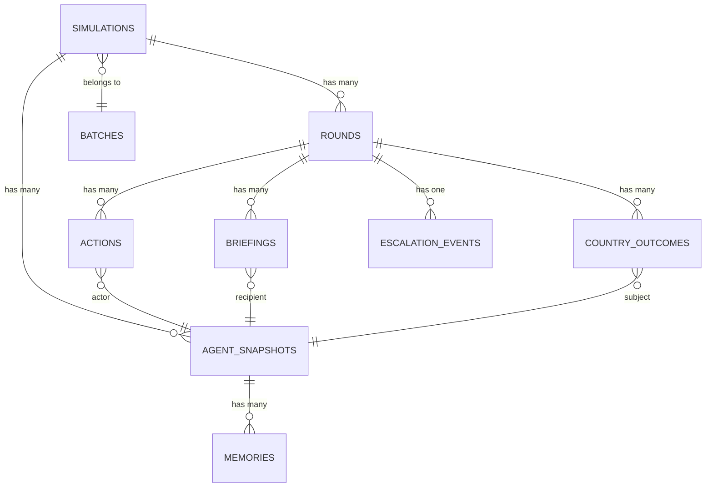

# Chapter 29: Wargame 2 — Optimal Data Architecture Redesign

> **Premise**: You built the simulation locally with SQLite for rapid iteration and demo. Now you're explaining to a Palantir FDE how you'd redesign the data layer for production — a **dual-store architecture** that separates the simulation hot path (document-oriented) from the analytics cold path (normalized SQL), connected by an ETL pipeline. Everything in Chapter 28 was the "v1 that shipped." This chapter is the "v2 I'd build knowing what I know now."

---

## 0. The Core Insight

The current architecture uses SQLite for *everything*: real-time state persistence during 104 concurrent simulations AND post-hoc analytical queries. This is architecturally wrong because the two workloads have **opposing requirements**:

| Requirement | Hot Path (Simulation) | Cold Path (Analytics) |
|-------------|----------------------|----------------------|
| **Schema** | Flexible, evolving (TypedDicts change frequently) | Rigid, normalized (optimized for JOIN/GROUP BY) |
| **Write pattern** | Many small partial updates per second | Bulk inserts after simulation completes |
| **Read pattern** | Read-your-own-writes (single simulation) | Cross-simulation aggregation |
| **Concurrency** | 104 writers simultaneously | Few readers, no writers during analysis |
| **Data shape** | Deeply nested (agents → briefings → actions) | Flat, tabular (one row per action) |
| **Latency** | Sub-millisecond writes critical | Query time is acceptable at seconds |
| **Durability** | Can lose partial state (simulation restarts) | Must be durable (analytical results) |

Forcing both through SQLite's single-writer lock is why we needed WAL mode, dual-layer retry, and 60-second busy timeouts. The redesign eliminates this impedance mismatch entirely.

---

## 1. Hot Path — Document Store for Simulation Runtime

### 1.1 Technology Choice: Why Each Option

| Option | Verdict | Reasoning |
|--------|---------|-----------|
| **MongoDB** | ✅ **Best fit for production** | Native document model, flexible schema, excellent concurrent write throughput, change streams for real-time UI. Deployable via Atlas (managed) or self-hosted. |
| **Firestore** | ⚠️ Good but costly at scale | Real-time listeners are excellent for the WebSocket use case, but per-document-write pricing makes 104-sim Monte Carlo batches expensive (~50 writes/sim/round × 10 rounds × 104 sims = ~52,000 writes per batch). |
| **DynamoDB** | ⚠️ Overkill | Designed for massive horizontal scale. Our concurrency ceiling is ~100 sims, not millions of requests/sec. Partition key design adds complexity without benefit. |
| **JSON files on disk** | ✅ **Best fit for local dev** | Zero infrastructure. One `.json` file per simulation. Reads/writes are atomic at the OS level. No concurrency issues since each simulation writes its own file. **This is what you'd use for the local demo.** |
| **Redis (in-memory)** | ⚠️ Fast but volatile | Perfect write performance, but data eviction risks losing simulation state mid-run. Would need Redis Streams + persistence config. |

### 1.2 The Local-First Strategy

For the demo (running on your laptop), the optimal hot-path store is **one JSON file per simulation**:

```
data/
├── simulations/
│   ├── {sim_id_1}.json     ← Full SimulationState document
│   ├── {sim_id_2}.json
│   └── ...
└── batches/
    └── {batch_id}.json      ← Batch metadata
```

**Why this eliminates every concurrency problem**:
- Each simulation writes to its own file → **zero lock contention**
- No WAL mode needed
- No busy_timeout needed  
- No retry logic needed
- 104 concurrent simulations = 104 independent file handles

**For production deployment** (MongoDB Atlas):
- Same document schema, different persistence backend
- Swap `JsonFileStore` for `MongoStore` — same interface
- MongoDB handles concurrent writes natively via WiredTiger (document-level locking)
- Change streams replace WebSocket polling for real-time UI updates

### 1.3 Document Schema

Each simulation is a single document. This mirrors the existing `SimulationState` TypedDict exactly — no transformation needed:

```json
{
  "_id": "550e8400-e29b-41d4-a716-446655440000",
  "crisis_description": "China blockades Taiwan...",
  "max_rounds": 10,
  "created_at": "2026-03-15T10:30:00Z",
  "status": "running",
  "batch_id": "batch-uuid-here",
  
  "escalation": {
    "current_level": 12,
    "initial_level": 5,
    "peak_level": 15,
    "reasoning": "Initial assessment: ...",
    "history": [
      {"round": 1, "level": 8, "change": 3, "reason": "..."},
      {"round": 2, "level": 12, "change": 4, "reason": "..."}
    ]
  },

  "agents": {
    "USA": {
      "country_code": "USA",
      "country_name": "United States",
      "leader_name": "Donald Trump",
      "leader_title": "President",
      "persona_description": "Transactional, unpredictable...",
      "recent_events_research": "...",
      "cabinet_roster": "...",
      "current_briefing": "...",
      "reason_drawn_in": ""
    },
    "CHN": { "..." : "..." }
  },

  "rounds": [
    {
      "round_number": 1,
      "escalation_before": 5,
      "escalation_after": 8,
      "turn_order": ["USA", "CHN", "TWN"],
      "turn_order_reasoning": "USA acts first due to...",
      "summary": "In the first round, tensions escalated...",
      "summary_short": "Tensions rose as...",
      "adjudication": "The neutral judge assessed...",
      "adjudication_short": "Judge: ...",
      "briefings": {
        "USA": {
          "intelligence": "CIA reports...",
          "military": "PACOM recommends...",
          "political": "Congress is pushing...",
          "economic": "Trade exposure to China is..."
        }
      },
      "actions": [
        {
          "round_number": 1,
          "actor": "USA",
          "actor_name": "Donald Trump",
          "action_type": "MILITARY",
          "target": "TWN",
          "description": "Ordered carrier strike group...",
          "public_statement": "We stand with our allies...",
          "private_channels": null,
          "reasoning": "Internal: Need to show strength..."
        }
      ],
      "country_outcomes": {
        "USA": {
          "round_impact": -1,
          "round_label": "somewhat_worse",
          "round_reasoning": "Military commitment increases risk...",
          "cumulative_impact": -1,
          "cumulative_label": "somewhat_worse",
          "cumulative_reasoning": "..."
        }
      }
    }
  ],

  "memories": {
    "USA": [
      {
        "round_number": 1,
        "timestamp": "2026-03-15T10:35:00Z",
        "content": "China moved carrier group into South China Sea",
        "importance": 8,
        "is_reflection": false,
        "consolidated": false
      }
    ]
  },

  "simulation_summary": null,
  "simulation_summary_short": null,
  "is_complete": false,
  "end_reason": null
}
```

**Key difference from the current architecture**: The document IS the state. There's no `final_state` TEXT column containing a serialized copy — the document *is* the canonical representation. LangGraph's state maps 1:1 to this document, eliminating the "shadow state" anti-pattern from Chapter 28.

### 1.4 How LangGraph's State Passes Through

```
┌─────────────────────────────────────────────────┐
│              LangGraph Runtime                   │
│                                                  │
│  SimulationState (TypedDict)                     │
│  ← Reducers merge partial updates               │
└──────────────┬───────────────────────────────────┘
               │ After each node completes
               ▼
┌─────────────────────────────────────────────────┐
│         Document Store Adapter                   │
│                                                  │
│  Local:  write_json(sim_id, state_dict)          │
│  Prod:   db.simulations.replace_one(             │
│            {"_id": sim_id},                      │
│            state_dict,                           │
│            upsert=True                           │
│          )                                       │
└──────────────┬───────────────────────────────────┘
               │
               ▼
┌─────────────────────────────────────────────────┐
│  data/simulations/{sim_id}.json   (local)       │
│  — or —                                          │
│  MongoDB: simulations collection   (production)  │
└─────────────────────────────────────────────────┘
```

The adapter interface:

```python
class SimulationStore(Protocol):
    """Abstract interface — swap implementations without changing graph code."""
    
    async def save_state(self, sim_id: str, state: dict) -> None: ...
    async def load_state(self, sim_id: str) -> dict | None: ...
    async def delete_state(self, sim_id: str) -> None: ...
    async def list_by_batch(self, batch_id: str) -> list[dict]: ...


class JsonFileStore(SimulationStore):
    """Local dev: one JSON file per simulation. Zero infrastructure."""
    
    def __init__(self, base_dir: str = "data/simulations"):
        self.base_dir = Path(base_dir)
        self.base_dir.mkdir(parents=True, exist_ok=True)
    
    async def save_state(self, sim_id: str, state: dict) -> None:
        path = self.base_dir / f"{sim_id}.json"
        # Atomic write: write to temp file, then rename
        tmp = path.with_suffix(".tmp")
        tmp.write_text(json.dumps(state, default=str, indent=2))
        tmp.rename(path)  # Atomic on POSIX
    
    async def load_state(self, sim_id: str) -> dict | None:
        path = self.base_dir / f"{sim_id}.json"
        if not path.exists():
            return None
        return json.loads(path.read_text())


class MongoStore(SimulationStore):
    """Production: MongoDB Atlas with document-level concurrency."""
    
    def __init__(self, uri: str, db_name: str = "wargame"):
        self.client = AsyncIOMotorClient(uri)
        self.db = self.client[db_name]
        self.collection = self.db.simulations
    
    async def save_state(self, sim_id: str, state: dict) -> None:
        await self.collection.replace_one(
            {"_id": sim_id}, state, upsert=True
        )
    
    async def load_state(self, sim_id: str) -> dict | None:
        return await self.collection.find_one({"_id": sim_id})
```

### 1.5 Handling 104 Concurrent Simulations

| Approach | Local (JSON files) | Production (MongoDB) |
|----------|-------------------|---------------------|
| **Concurrency model** | Each sim writes its own file. OS handles file-level isolation. | MongoDB's WiredTiger engine provides document-level locking. 104 docs = 104 independent locks. |
| **Write contention** | **Zero.** No shared resource. | **Zero.** Each sim updates a different document. |
| **Read-your-own-writes** | Guaranteed (single process, single file) | Guaranteed (MongoDB's default read concern) |
| **Failure isolation** | One corrupted file = one lost sim. Others unaffected. | Same — document-level atomicity. |

> **Interview framing**: "For the demo I used JSON files on disk — zero infrastructure, zero concurrency issues because each simulation writes to its own file. For production I'd swap in MongoDB Atlas with the same interface. The key insight is that simulation state is **embarrassingly parallel** — 104 simulations never need to read or write each other's state during execution."

---

## 2. Cold Path — Normalized SQL for Post-Simulation Analytics

Once a simulation completes, its document gets **shredded** into normalized relational tables for analytical queries. This is where Palantir's Foundry ontology thinking applies: each entity (simulation, round, action, agent, briefing, memory) gets its own object type with explicit relationships.

### 2.1 Entity-Relationship Diagram



### 2.2 Full 3NF DDL — PostgreSQL

#### Table 1: `batches` — Monte Carlo batch grouping

```sql
CREATE TABLE batches (
    id              UUID PRIMARY KEY DEFAULT gen_random_uuid(),
    crisis          TEXT NOT NULL,
    crisis_summary  TEXT,
    simulation_count INTEGER NOT NULL DEFAULT 0,
    created_at      TIMESTAMPTZ NOT NULL DEFAULT NOW(),
    
    -- RAG / File Search metadata
    file_search_store TEXT,
    index_status      TEXT NOT NULL DEFAULT 'pending'
        CHECK (index_status IN ('pending','building','ready','failed'))
);
```

**Why separate**: Batches are a first-class entity referenced by many simulations. Denormalizing `crisis` into every simulation row wastes space and creates update anomalies.

---

#### Table 2: `simulations` — One row per simulation run

```sql
CREATE TABLE simulations (
    id                  UUID PRIMARY KEY DEFAULT gen_random_uuid(),
    batch_id            UUID REFERENCES batches(id) ON DELETE CASCADE,
    crisis              TEXT NOT NULL,
    status              TEXT NOT NULL DEFAULT 'running'
        CHECK (status IN ('running','completed','failed','cancelled')),
    
    -- Escalation metrics (promoted from document for aggregate queries)
    initial_escalation  SMALLINT,
    final_escalation    SMALLINT,
    peak_escalation     SMALLINT,
    escalation_reasoning TEXT,
    
    -- Completion metadata
    rounds_completed    SMALLINT NOT NULL DEFAULT 0,
    max_rounds          SMALLINT NOT NULL DEFAULT 10,
    end_reason          TEXT,
    
    -- Summaries (promoted for list-view display without JOINs)
    simulation_summary       TEXT,
    simulation_summary_short TEXT,
    
    -- Timestamps
    created_at          TIMESTAMPTZ NOT NULL DEFAULT NOW(),
    completed_at        TIMESTAMPTZ,
    
    -- Participating actors (denormalized array for fast heatmap queries)
    participating_actors TEXT[] NOT NULL DEFAULT '{}'
);

CREATE INDEX idx_sim_batch ON simulations(batch_id);
CREATE INDEX idx_sim_status ON simulations(status);
CREATE INDEX idx_sim_actors ON simulations USING GIN(participating_actors);
```

**Why `TEXT[]` for actors**: PostgreSQL native arrays support `@>` (contains) and GIN indexing. `SELECT * FROM simulations WHERE participating_actors @> ARRAY['CHN']` is a single indexed lookup — no JSON parsing, no separate join table.

**Why `SMALLINT` for escalation**: Kahn's ladder is 1-44. `SMALLINT` (2 bytes) vs `INTEGER` (4 bytes) saves 50% per row, and over 100K simulations that adds up.

---

#### Table 3: `agent_snapshots` — One row per agent per simulation

```sql
CREATE TABLE agent_snapshots (
    id                      UUID PRIMARY KEY DEFAULT gen_random_uuid(),
    simulation_id           UUID NOT NULL REFERENCES simulations(id) ON DELETE CASCADE,
    country_code            VARCHAR(3) NOT NULL,      -- ISO 3166-1 alpha-3
    country_name            TEXT NOT NULL,
    leader_name             TEXT NOT NULL,
    leader_title            TEXT NOT NULL,
    persona_description     TEXT,
    recent_events_research  TEXT,
    cabinet_roster          TEXT,
    reason_drawn_in         TEXT,
    
    UNIQUE(simulation_id, country_code)
);

CREATE INDEX idx_agent_sim ON agent_snapshots(simulation_id);
CREATE INDEX idx_agent_country ON agent_snapshots(country_code);
```

**Why separate from simulations**: Without this table, agent data lives buried in `final_state.agents`. You can't ask "In how many simulations was Xi Jinping drawn in as a secondary participant?" without parsing every JSON blob. With this table: `SELECT COUNT(*) FROM agent_snapshots WHERE country_code = 'CHN' AND reason_drawn_in != ''`.

---

#### Table 4: `rounds` — One row per round per simulation

```sql
CREATE TABLE rounds (
    id                  UUID PRIMARY KEY DEFAULT gen_random_uuid(),
    simulation_id       UUID NOT NULL REFERENCES simulations(id) ON DELETE CASCADE,
    round_number        SMALLINT NOT NULL,
    
    -- Escalation transition
    escalation_before   SMALLINT,
    escalation_after    SMALLINT,
    
    -- Turn management
    turn_order          TEXT[] NOT NULL DEFAULT '{}',
    turn_order_reasoning TEXT,
    
    -- Narratives
    summary             TEXT,
    summary_short       TEXT,
    adjudication        TEXT,
    adjudication_short  TEXT,
    
    -- Escalation analysis
    kahn_analysis       TEXT,
    
    created_at          TIMESTAMPTZ NOT NULL DEFAULT NOW(),
    
    UNIQUE(simulation_id, round_number)
);

CREATE INDEX idx_round_sim ON rounds(simulation_id);
```

**Why this is cleaner than the current approach**: The current `rounds` table stores `actions` and `turn_order` as JSON TEXT blobs. Here, `turn_order` is a native PostgreSQL array (indexable), and actions are in their own table.

---

#### Table 5: `actions` — One row per leader action (fully normalized)

```sql
CREATE TABLE actions (
    id              UUID PRIMARY KEY DEFAULT gen_random_uuid(),
    round_id        UUID NOT NULL REFERENCES rounds(id) ON DELETE CASCADE,
    simulation_id   UUID NOT NULL REFERENCES simulations(id) ON DELETE CASCADE,
    round_number    SMALLINT NOT NULL,
    
    -- Actor
    actor_code      VARCHAR(3) NOT NULL,                -- FK-like to agent_snapshots
    actor_name      TEXT NOT NULL,                       -- Denormalized for query convenience
    
    -- Action details
    action_type     TEXT NOT NULL
        CHECK (action_type IN ('STATEMENT','MILITARY','ECONOMIC','DIPLOMATIC','INTELLIGENCE','OTHER')),
    target_code     VARCHAR(3),                          -- Nullable: some actions are unilateral
    description     TEXT NOT NULL,
    public_statement TEXT,
    private_channels TEXT,
    reasoning       TEXT,                                -- Internal thought (never shown to other agents)
    
    -- Ordering within a round
    action_order    SMALLINT NOT NULL DEFAULT 0
);

CREATE INDEX idx_action_round ON actions(round_id);
CREATE INDEX idx_action_sim ON actions(simulation_id);
CREATE INDEX idx_action_actor ON actions(actor_code);
CREATE INDEX idx_action_type ON actions(action_type);
CREATE INDEX idx_action_target ON actions(target_code);
```

**Why this is the biggest win of normalization**: The current architecture stores actions as `json.dumps([{...}, {...}])` in `rounds.actions`. You literally cannot run:

```sql
-- IMPOSSIBLE with current schema:
SELECT actor_code, action_type, COUNT(*) 
FROM actions 
WHERE simulation_id IN (SELECT id FROM simulations WHERE batch_id = ?)
GROUP BY actor_code, action_type;
```

This query answers "Across 100 Monte Carlo simulations, how many military actions did China take vs diplomatic?" — a fundamental analytical question that currently requires loading every simulation's JSON, parsing it, and counting in Python.

---

#### Table 6: `briefings` — One row per country per round

```sql
CREATE TABLE briefings (
    id              UUID PRIMARY KEY DEFAULT gen_random_uuid(),
    round_id        UUID NOT NULL REFERENCES rounds(id) ON DELETE CASCADE,
    country_code    VARCHAR(3) NOT NULL,
    
    intelligence    TEXT,
    military        TEXT,
    political       TEXT,
    economic        TEXT,
    
    UNIQUE(round_id, country_code)
);

CREATE INDEX idx_briefing_round ON briefings(round_id);
```

**Why separate**: Briefings are per-country-per-round data. In the current schema, they're nested inside `final_state.round_summaries[n].briefings.USA`. Normalizing lets you query "What military advice did the USA receive across all simulations?" directly.

---

#### Table 7: `country_outcomes` — Per-country impact per round

```sql
CREATE TABLE country_outcomes (
    id                  UUID PRIMARY KEY DEFAULT gen_random_uuid(),
    round_id            UUID NOT NULL REFERENCES rounds(id) ON DELETE CASCADE,
    country_code        VARCHAR(3) NOT NULL,
    
    round_impact        SMALLINT NOT NULL CHECK (round_impact BETWEEN -2 AND 2),
    round_label         TEXT NOT NULL,
    round_reasoning     TEXT,
    
    cumulative_impact   SMALLINT NOT NULL CHECK (cumulative_impact BETWEEN -2 AND 2),
    cumulative_label    TEXT NOT NULL,
    cumulative_reasoning TEXT,
    
    UNIQUE(round_id, country_code)
);

CREATE INDEX idx_outcome_round ON country_outcomes(round_id);
CREATE INDEX idx_outcome_country ON country_outcomes(country_code);
CREATE INDEX idx_outcome_cum_label ON country_outcomes(cumulative_label);
```

**Why separate**: Outcome distributions across Monte Carlo runs are the primary analytical output. With this table: `SELECT cumulative_label, COUNT(*) FROM country_outcomes co JOIN rounds r ON co.round_id = r.id WHERE r.round_number = r.simulation_id IN (...) GROUP BY cumulative_label` gives you the outcome distribution directly.

---

#### Table 8: `escalation_events` — Dedicated escalation timeline

```sql
CREATE TABLE escalation_events (
    id              UUID PRIMARY KEY DEFAULT gen_random_uuid(),
    simulation_id   UUID NOT NULL REFERENCES simulations(id) ON DELETE CASCADE,
    round_number    SMALLINT NOT NULL,
    
    level_before    SMALLINT,
    level_after     SMALLINT,
    delta           SMALLINT GENERATED ALWAYS AS (level_after - level_before) STORED,
    reasoning       TEXT,
    
    UNIQUE(simulation_id, round_number)
);

CREATE INDEX idx_esc_sim ON escalation_events(simulation_id);
CREATE INDEX idx_esc_level ON escalation_events(level_after);
```

**Why separate from `rounds`**: The `delta` computed column enables queries like "Find all simulations where escalation jumped by 5+ rungs in a single round" without computation. The current schema requires loading every round and computing the difference in Python.

---

#### Table 9: `memories` — Smallville memory stream

```sql
CREATE TABLE memories (
    id              UUID PRIMARY KEY DEFAULT gen_random_uuid(),
    simulation_id   UUID NOT NULL REFERENCES simulations(id) ON DELETE CASCADE,
    country_code    VARCHAR(3) NOT NULL,
    round_number    SMALLINT NOT NULL,
    
    content         TEXT NOT NULL,
    importance      SMALLINT NOT NULL CHECK (importance BETWEEN 1 AND 10),
    is_reflection   BOOLEAN NOT NULL DEFAULT FALSE,
    consolidated    BOOLEAN NOT NULL DEFAULT FALSE,
    
    created_at      TIMESTAMPTZ NOT NULL DEFAULT NOW()
);

CREATE INDEX idx_mem_sim ON memories(simulation_id);
CREATE INDEX idx_mem_country ON memories(country_code);
CREATE INDEX idx_mem_importance ON memories(importance DESC);
```

**Why separate**: Memories are the highest-cardinality entity (~10-20 per agent per round × 5 agents × 10 rounds = ~500-1000 per simulation). Storing them as a JSON list inside `final_state.agent_memories.USA[...]` makes it impossible to query high-importance reflections across simulations.

---

#### Table 10: `simulation_embeddings` — Vector storage for semantic search

```sql
CREATE TABLE simulation_embeddings (
    id              UUID PRIMARY KEY DEFAULT gen_random_uuid(),
    simulation_id   UUID NOT NULL REFERENCES simulations(id) ON DELETE CASCADE,
    round_id        UUID REFERENCES rounds(id) ON DELETE CASCADE,  -- NULL = simulation-level
    
    chunk_type      TEXT NOT NULL 
        CHECK (chunk_type IN ('summary','action','briefing','adjudication','memory','full_narrative')),
    chunk_text      TEXT NOT NULL,                        -- The text that was embedded
    embedding       vector(768) NOT NULL,                 -- pgvector type
    
    -- Metadata for filtering before similarity search
    country_code    VARCHAR(3),                           -- NULL for simulation-level chunks
    round_number    SMALLINT,
    
    created_at      TIMESTAMPTZ NOT NULL DEFAULT NOW()
);

-- HNSW index for approximate nearest-neighbor search
CREATE INDEX idx_emb_vector ON simulation_embeddings 
    USING hnsw (embedding vector_cosine_ops)
    WITH (m = 16, ef_construction = 64);

-- Composite filter indexes for scoped searches
CREATE INDEX idx_emb_sim ON simulation_embeddings(simulation_id);
CREATE INDEX idx_emb_type ON simulation_embeddings(chunk_type);
CREATE INDEX idx_emb_country ON simulation_embeddings(country_code);
```

See Section 4 for the full embedding strategy.

---

## 3. The ETL Pipeline

### 3.1 When It Runs

```
Simulation completes
        │
        ▼
┌──────────────────────┐     ┌──────────────────────┐     ┌──────────────────┐
│  Document Store      │────▶│  ETL Pipeline         │────▶│  PostgreSQL      │
│  (hot path)          │     │  (shred + insert)     │     │  (cold path)     │
│                      │     │                       │     │                  │
│  {sim_id}.json       │     │  1. Load document     │     │  simulations     │
│  — or —              │     │  2. Validate schema   │     │  rounds          │
│  MongoDB document    │     │  3. Extract entities  │     │  actions         │
│                      │     │  4. Generate INSERTs  │     │  briefings       │
│                      │     │  5. Generate embeddings│    │  memories        │
│                      │     │  6. Transactional write│    │  embeddings      │
└──────────────────────┘     └──────────────────────┘     └──────────────────┘
```

For **local dev**: ETL runs in-process after `run_simulation()` completes, targeting a local PostgreSQL (or even SQLite with the normalized schema).

For **production**: ETL is triggered by a MongoDB change stream or a completion webhook, runs as a Cloud Function / Cloud Run job.

### 3.2 The Shredding Logic — Document → Rows

```python
async def etl_simulation(doc: dict, db: AsyncConnection) -> None:
    """Shred a completed simulation document into normalized SQL rows."""
    
    sim_id = doc["_id"]
    
    async with db.transaction():
        # ── 1. Simulation row ──
        await db.execute("""
            INSERT INTO simulations 
            (id, batch_id, crisis, status, initial_escalation, final_escalation,
             peak_escalation, escalation_reasoning, rounds_completed, max_rounds,
             end_reason, simulation_summary, simulation_summary_short,
             participating_actors, created_at, completed_at)
            VALUES ($1,$2,$3,$4,$5,$6,$7,$8,$9,$10,$11,$12,$13,$14,$15,$16)
        """, sim_id, doc.get("batch_id"), doc["crisis_description"],
             doc["status"], doc["escalation"]["initial_level"],
             doc["escalation"]["current_level"], doc["escalation"]["peak_level"],
             doc["escalation"]["reasoning"], len(doc["rounds"]),
             doc["max_rounds"], doc.get("end_reason"),
             doc.get("simulation_summary"), doc.get("simulation_summary_short"),
             list(doc["agents"].keys()),
             doc["created_at"], doc.get("completed_at"))
        
        # ── 2. Agent snapshots ──
        for code, agent in doc["agents"].items():
            await db.execute("""
                INSERT INTO agent_snapshots
                (simulation_id, country_code, country_name, leader_name,
                 leader_title, persona_description, recent_events_research,
                 cabinet_roster, reason_drawn_in)
                VALUES ($1,$2,$3,$4,$5,$6,$7,$8,$9)
            """, sim_id, code, agent["country_name"], agent["leader_name"],
                 agent["leader_title"], agent.get("persona_description"),
                 agent.get("recent_events_research"), agent.get("cabinet_roster"),
                 agent.get("reason_drawn_in", ""))
        
        # ── 3. Rounds + nested entities ──
        for rnd in doc["rounds"]:
            round_id = uuid4()
            rn = rnd["round_number"]
            
            await db.execute("""
                INSERT INTO rounds
                (id, simulation_id, round_number, escalation_before, escalation_after,
                 turn_order, turn_order_reasoning, summary, summary_short,
                 adjudication, adjudication_short, kahn_analysis)
                VALUES ($1,$2,$3,$4,$5,$6,$7,$8,$9,$10,$11,$12)
            """, round_id, sim_id, rn, rnd["escalation_before"],
                 rnd["escalation_after"], rnd.get("turn_order", []),
                 rnd.get("turn_order_reasoning"), rnd.get("summary"),
                 rnd.get("summary_short"), rnd.get("adjudication"),
                 rnd.get("adjudication_short"), rnd.get("kahn_analysis"))
            
            # ── 3a. Actions ──
            for i, action in enumerate(rnd.get("actions", [])):
                await db.execute("""
                    INSERT INTO actions
                    (round_id, simulation_id, round_number, actor_code, actor_name,
                     action_type, target_code, description, public_statement,
                     private_channels, reasoning, action_order)
                    VALUES ($1,$2,$3,$4,$5,$6,$7,$8,$9,$10,$11,$12)
                """, round_id, sim_id, rn, action["actor"], action["actor_name"],
                     action["action_type"], action.get("target"),
                     action["description"], action.get("public_statement"),
                     action.get("private_channels"), action.get("reasoning"), i)
            
            # ── 3b. Briefings ──
            for code, briefing in rnd.get("briefings", {}).items():
                await db.execute("""
                    INSERT INTO briefings
                    (round_id, country_code, intelligence, military, political, economic)
                    VALUES ($1,$2,$3,$4,$5,$6)
                """, round_id, code, briefing.get("intelligence"),
                     briefing.get("military"), briefing.get("political"),
                     briefing.get("economic"))
            
            # ── 3c. Country outcomes ──
            for code, outcome in rnd.get("country_outcomes", {}).items():
                await db.execute("""
                    INSERT INTO country_outcomes
                    (round_id, country_code, round_impact, round_label,
                     round_reasoning, cumulative_impact, cumulative_label,
                     cumulative_reasoning)
                    VALUES ($1,$2,$3,$4,$5,$6,$7,$8)
                """, round_id, code, outcome["round_impact"], outcome["round_label"],
                     outcome.get("round_reasoning"), outcome["cumulative_impact"],
                     outcome["cumulative_label"], outcome.get("cumulative_reasoning"))
            
            # ── 3d. Escalation events ──
            await db.execute("""
                INSERT INTO escalation_events
                (simulation_id, round_number, level_before, level_after, reasoning)
                VALUES ($1,$2,$3,$4,$5)
            """, sim_id, rn, rnd["escalation_before"], rnd["escalation_after"],
                 rnd.get("kahn_analysis"))
        
        # ── 4. Memories ──
        for code, memory_list in doc.get("memories", {}).items():
            for mem in memory_list:
                await db.execute("""
                    INSERT INTO memories
                    (simulation_id, country_code, round_number, content,
                     importance, is_reflection, consolidated)
                    VALUES ($1,$2,$3,$4,$5,$6,$7)
                """, sim_id, code, mem["round_number"], mem["content"],
                     mem["importance"], mem.get("is_reflection", False),
                     mem.get("consolidated", False))
```

### 3.3 Field Mapping Table — Document → SQL

| Document Path | SQL Table.Column | Transform |
|--------------|-----------------|-----------|
| `_id` | `simulations.id` | Direct |
| `batch_id` | `simulations.batch_id` | Direct |
| `crisis_description` | `simulations.crisis` | Rename |
| `escalation.current_level` | `simulations.final_escalation` | Extract from nested |
| `escalation.peak_level` | `simulations.peak_escalation` | Extract from nested |
| `agents.keys()` | `simulations.participating_actors` | Dict keys → TEXT[] |
| `agents.{code}.*` | `agent_snapshots.*` | Flatten dict entry → row |
| `rounds[n].*` | `rounds.*` | Array element → row |
| `rounds[n].actions[m].*` | `actions.*` | Nested array → row |
| `rounds[n].briefings.{code}.*` | `briefings.*` | Nested dict → row |
| `rounds[n].country_outcomes.{code}.*` | `country_outcomes.*` | Nested dict → row |
| `rounds[n].escalation_before/after` | `escalation_events.*` | Extract + computed `delta` |
| `memories.{code}[n].*` | `memories.*` | Nested array → row |

---

## 4. Embedding Strategy

### 4.1 What Gets Embedded

Not everything should be embedded. The **embedding candidates** ranked by semantic retrieval value:

| Chunk Type | Source | Why Embed It |
|-----------|--------|-------------|
| `summary` | `rounds.summary` | Best single-round narrative for "what happened in round 3?" |
| `adjudication` | `rounds.adjudication` | Neutral analysis — best for factual retrieval |
| `action` | `actions.description` | Enables "find all naval deployments" across simulations |
| `briefing` | `briefings.intelligence + military + ...` | Concatenated 4-perspective brief |
| `memory` | `memories.content` (importance ≥ 7) | High-importance memories only (avoid noise) |
| `full_narrative` | `simulations.simulation_summary` | Whole-simulation retrieval |

### 4.2 Why pgvector Over Alternatives

| Option | Verdict | Reasoning |
|--------|---------|-----------|
| **pgvector** | ✅ **Best fit** | Lives in the same PostgreSQL instance as the analytical data. No separate vector DB to manage. HNSW indexes give O(log n) ANN search. |
| **FLOAT8[]** (what Siren uses) | ❌ No index support | Works for small datasets but requires full table scan for similarity — O(n). Fine for Siren's ~100 embeddings, catastrophic for 100K simulation chunks. |
| **Pinecone / Weaviate** | ⚠️ Overkill | Managed vector DBs add operational complexity and cost. Our scale (~1000 chunks per batch) doesn't justify a separate service. |
| **ChromaDB** | ⚠️ Good for local | Excellent for local dev (file-based), but no managed cloud offering. Same problem as SQLite. |

### 4.3 The Embedding Pipeline

```python
async def generate_embeddings(sim_id: UUID, db: AsyncConnection) -> None:
    """Generate and store embeddings for a completed simulation."""
    
    # 1. Gather chunks
    chunks = []
    
    # Round summaries
    rows = await db.fetch("SELECT id, round_number, summary FROM rounds WHERE simulation_id = $1", sim_id)
    for r in rows:
        if r["summary"]:
            chunks.append({"round_id": r["id"], "round_number": r["round_number"],
                          "chunk_type": "summary", "text": r["summary"]})
    
    # Actions
    rows = await db.fetch("""
        SELECT a.round_id, a.round_number, a.actor_code, a.description 
        FROM actions a WHERE a.simulation_id = $1
    """, sim_id)
    for r in rows:
        chunks.append({"round_id": r["round_id"], "round_number": r["round_number"],
                       "country_code": r["actor_code"], "chunk_type": "action",
                       "text": r["description"]})
    
    # High-importance memories
    rows = await db.fetch("""
        SELECT country_code, round_number, content 
        FROM memories WHERE simulation_id = $1 AND importance >= 7
    """, sim_id)
    for r in rows:
        chunks.append({"round_number": r["round_number"], "country_code": r["country_code"],
                       "chunk_type": "memory", "text": r["content"]})
    
    # 2. Batch embed (Gemini text-embedding-004, 768 dims)
    texts = [c["text"] for c in chunks]
    embeddings = await embed_batch(texts)  # Returns list of 768-dim vectors
    
    # 3. Bulk insert
    for chunk, emb in zip(chunks, embeddings):
        await db.execute("""
            INSERT INTO simulation_embeddings
            (simulation_id, round_id, chunk_type, chunk_text, embedding,
             country_code, round_number)
            VALUES ($1, $2, $3, $4, $5, $6, $7)
        """, sim_id, chunk.get("round_id"), chunk["chunk_type"],
             chunk["text"], emb, chunk.get("country_code"), chunk.get("round_number"))
```

### 4.4 Querying Embeddings with Metadata Filters

The power of pgvector in PostgreSQL is that you can combine **vector similarity** with **relational filters** in a single query:

```sql
-- "Find the most similar military actions to 'carrier deployment'
--  but only from China, across all simulations in this batch"
SELECT a.description, a.actor_code, a.round_number,
       se.embedding <=> $1 AS distance
FROM simulation_embeddings se
JOIN actions a ON a.round_id = se.round_id 
    AND a.actor_code = se.country_code
JOIN simulations s ON s.id = se.simulation_id
WHERE s.batch_id = $2
  AND se.chunk_type = 'action'
  AND se.country_code = 'CHN'
ORDER BY se.embedding <=> $1
LIMIT 10;
```

This is impossible with separate vector DB + relational DB without a two-phase query.

---

## 5. Trade-off Analysis

### 5.1 Why Dual-Store Is Better

| Dimension | Current (SQLite-for-everything) | Proposed (Document + SQL) |
|-----------|--------------------------------|--------------------------|
| **Write concurrency** | Single-writer lock → WAL hacks → dual retry | Zero contention (one file/doc per sim) |
| **Schema flexibility** | Rigid columns OR opaque JSON blob | Document store has no schema constraint |
| **Analytical queries** | Parse JSON in Python → slow, error-prone | Native SQL GROUP BY/JOIN/WHERE |
| **Embedding search** | No vector support in SQLite | pgvector HNSW index |
| **Action-level analysis** | Impossible without JSON parsing | `SELECT * FROM actions WHERE actor_code = 'CHN'` |
| **Cross-sim aggregation** | Load all `final_state` blobs → Python | SQL aggregates over normalized tables |
| **Data lineage** | Opaque — data buried in nested JSON | Explicit FKs trace every row to its source |
| **Export/Import** | Custom JSON format | Document store IS the export format |

### 5.2 What You Lose (Honest Downsides)

| Downside | Severity | Mitigation |
|----------|----------|------------|
| **Operational complexity** | Medium | Two datastores to manage instead of one. For local dev, JSON files + SQLite mitigates this (no MongoDB needed). |
| **ETL latency** | Low | Analytics aren't available until ETL completes (~seconds per simulation). Acceptable since analysis happens after batch completion. |
| **Data duplication** | Low | The document stays in the hot store, and a copy exists in the cold store. ~2x storage. Mitigated by archiving/deleting documents after ETL for completed simulations. |
| **Consistency risk** | Low | If ETL fails mid-way, the SQL store has partial data. Mitigated by wrapping ETL in a transaction (shown above). |
| **Schema drift** | Medium | If the TypedDict changes but ETL isn't updated, the SQL schema goes stale. Mitigated by Pydantic validation at the ETL boundary. |

### 5.3 When NOT to Use This Pattern

| Scenario | Why Single-Store Is Better |
|----------|---------------------------|
| **< 5 concurrent simulations** | SQLite's single-writer lock is fine. WAL + retry handles it. Dual-store adds unjustified complexity. |
| **No analytical queries needed** | If you only need "show me this simulation," the document store alone is sufficient. The SQL layer only pays for itself when you need cross-simulation GROUP BY. |
| **Real-time analytics during simulation** | If you need live dashboards that query across running sims, you need writes to go directly to SQL (or use a stream processor like Kafka → Flink → SQL). The ETL-after-completion pattern has inherent latency. |
| **Embedded systems / edge deployment** | SQLite's single-file portability is unbeatable. The dual-store requires PostgreSQL, which needs a server process. |

### 5.4 The Palantir Framing

> **In Palantir vocabulary**: The hot-path document store is the **raw source system** — it captures operational data in its natural shape without forcing premature normalization. The ETL pipeline is the **integration layer** that maps source data into an **ontology** — a normalized, semantically rich schema where every entity (simulation, round, action, agent) is a first-class object type with explicit link types (foreign keys). The cold-path SQL store is the **Foundry dataset** — clean, queryable, ready for analytical applications. The embedding table adds a **semantic layer** that enables natural-language exploration of simulation outcomes.
> 
> This mirrors Palantir's core philosophy: **don't force the source system to conform to your analytical schema.** Capture data in whatever shape the source produces (documents, logs, streams), then transform it into a clean ontology asynchronously. The source system stays fast and flexible; the analytical layer stays normalized and queryable.

---

## 6. Deployment Path: Local → Production

The user's framing: "I built this locally for the demo, with plans to deploy."

| Component | Local (Demo) | Production |
|-----------|-------------|-----------|
| **Hot path** | JSON files in `data/simulations/` | MongoDB Atlas (managed) |
| **Cold path** | SQLite with normalized schema (or local PostgreSQL via Docker) | Supabase PostgreSQL (managed, includes pgvector) |
| **ETL** | In-process Python function after `run_simulation()` | Cloud Run job triggered by MongoDB change stream |
| **Embeddings** | Gemini `text-embedding-004` → pgvector in local PG | Same, but on Supabase |
| **RAG** | pgvector similarity search | Same, but with connection pooling via PgBouncer |
| **Swap mechanism** | `SimulationStore` protocol (Section 1.4) | Same interface, different `__init__` args |

> **Interview line**: "I designed the system with a `SimulationStore` protocol so the hot-path backend is pluggable. For the local demo, it's JSON files on disk — zero infrastructure, zero dependencies. For production, I swap in MongoDB Atlas with the same interface. The cold path uses PostgreSQL either way — locally via Docker, in production via Supabase. The architecture is the same; only the connection strings change."

---

## 7. Interview Cheat Sheet

### The 30-Second Pitch

> "The simulation generates deeply nested, rapidly-changing state — agents making decisions, memories accumulating, escalation shifting. During execution, that state lives in a document store because the schema is fluid and each simulation is independent. Once a simulation completes, an ETL pipeline shreds the document into a normalized star schema — separate tables for actions, briefings, memories, outcomes — so I can run analytical queries across hundreds of Monte Carlo runs. The key insight: **the write pattern and the read pattern have opposite data shape requirements**, so trying to serve both from one store creates an impedance mismatch."

### Follow-Up Answers Preloaded

**Q: "Why not just use PostgreSQL JSONB for everything?"**
> A: JSONB gives you the flexibility of documents inside PostgreSQL, but you lose the schema enforcement and query optimization of normalized tables. `WHERE data->'rounds'->0->'actions'->0->>'actor' = 'CHN'` is both ugly and slow — PostgreSQL can't use B-tree indexes on deeply nested JSONB paths without expression indexes on every path you might query. At that point, you're fighting the database instead of using it.

**Q: "What about eventual consistency between the two stores?"**
> A: The ETL runs after simulation completion, so there's a window where the document exists but the SQL rows don't. This is acceptable because analytical queries are only meaningful on completed simulations. I wrap the entire ETL in a database transaction — if any INSERT fails, the whole batch rolls back. The document store is the source of truth; the SQL store is a materialized view.

**Q: "How would you handle schema evolution?"**
> A: The document store doesn't care — it's schemaless. The SQL schema evolves via standard migrations (Alembic). The ETL pipeline has a Pydantic model at the boundary that validates the document against the expected schema before shredding. If a new field appears in the document, the ETL logs a warning and continues — the SQL schema picks it up in the next migration cycle.

**Q: "What if the ETL becomes a bottleneck?"**
> A: For 100 simulations, ETL takes ~10 seconds total (I/O-bound, not CPU-bound). At 10,000+ simulations, I'd batch the ETL writes using COPY instead of individual INSERTs, and parallelize across simulations (each is independent). The document store provides natural partitioning — each simulation is its own document, so the ETL is embarrassingly parallel.
